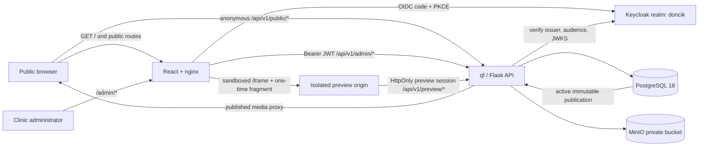
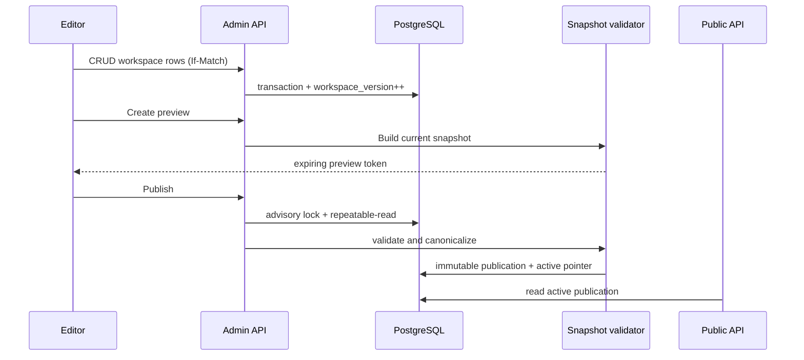

# DentNow Backend and Administration Architecture

**Status:** Proposed implementation architecture  
**Date:** 2026-07-11  
**Scope:** Replace frontend-owned website content with a qf-based backend, PostgreSQL authoring store, MinIO media store, and a Keycloak-protected administration experience with live preview.

## 1. Executive decision

DentNow will become a two-deployable modular application:

- The existing React SPA remains the public renderer. It contains layout, interaction, accessibility, and visual components, but no clinic-specific content or fallback business data.
- A Python backend built on the vendored `backend/dist/qf-1.0.5-py3-none-any.whl` exposes anonymous published-content APIs and authenticated administration APIs.
- PostgreSQL is the source of truth for all structured website content, configuration, publication history, audit history, and media metadata.
- MinIO stores image and document bytes. Browsers never receive MinIO credentials and never upload directly with permanent credentials.
- The authoring database is a mutable workspace. Publishing produces an immutable, validated site snapshot in PostgreSQL and atomically makes that snapshot active. Public requests only read the active snapshot.
- `/admin` and `/admin/*` use Keycloak OIDC Authorization Code flow with PKCE against realm `doncik`. All ordinary website routes are public; the isolated preview route uses only its short-lived possession session and never OAuth. `/api/v1/admin/*` independently verifies Keycloak bearer tokens; hiding a React route is never treated as authorization.
- The administration UI uses React 18, TypeScript, TanStack Query, Ant Design 6, and `cmdk`. The public site keeps its current custom visual system. Both use the same public rendering components for an accurate preview.
- qf's Kafka/ETL runtime is disabled. This website does not need Kafka or Redis in its first implementation.

This is a modular monolith, not a collection of microservices. The content, publication, media, IAM, and audit boundaries are explicit in code while sharing one API process and one PostgreSQL database.

## 2. Confirmed invariants

1. Public pages, published media, `robots.txt`, and `sitemap.xml` are anonymously accessible.
2. Only `/admin` and its child routes initiate Keycloak login.
3. The Keycloak realm is `doncik` in local and deployed environments.
4. Every administration mutation is authorized again in the backend.
5. Structured content lives in PostgreSQL; binary media lives in MinIO with PostgreSQL metadata and references.
6. The public frontend never imports clinic content from `src/data`, page-local constants, or Vite content environment variables.
7. An administrator can manage every existing website content category, preview the result with the real public renderer, publish atomically, and roll back to an earlier publication.
8. The backend must use the qf wheel requested for this project and follow its actual integration contract.

## 3. Current-state findings

The current site is a React 18/Vite SPA served by nginx. It has no API client, no persistent backend, and no administration route. Content is spread across centralized modules, environment fallbacks, and component-local constants.

| Current owner | Content found there | Target owner |
| --- | --- | --- |
| `src/config.js` and `.env` | Phone lines, email, addresses, clinic hours, map links, review link, social profiles, website URL | Site settings, clinics, clinic contacts/hours, and social links |
| `src/data/content.js` | Services, quick services, offers, prices, treatment categories, partners, cases, ebooks, news, quiz, schedule | Catalog, editorial, quiz, and clinic modules |
| `src/data/articles.js` | Article metadata and HTML bodies | Editorial articles with safe rich text |
| `src/data/reviews.js` | Review text, author, relative date, rating assumption | Reviews with source URL, real date, rating, and verification metadata |
| `src/data/navigation.js` | Desktop/mobile/footer menus | Named navigation menus and ordered items |
| `src/data/clinicProof.js` | Gallery, doctors, technology, patient journey, cases | Media, team, technology, page sections, and case studies |
| `src/pages/LocationPage.jsx` | A second, richer clinic dataset, transit information, FAQs, SEO | Clinics, transit instructions, clinic FAQs, SEO |
| `src/pages/TreatmentDetail.jsx` | Four detailed treatment landing pages, prices, benefits, FAQs, unsafe HTML | Treatments, prices, FAQs, typed page sections |
| `src/pages/DecontatCas.jsx` | CAS claims, steps, services, required documents, FAQs | Managed CAS page and typed sections |
| `src/pages/UrgenteDentare.jsx` | Emergency copy, triage content, hours, structured data | Managed emergency page and typed sections |
| `src/pages/LegalContent.jsx` | GDPR, privacy, and terms sections | Versioned legal documents |
| Page and section components | Hero text, section headings, CTA text, rating `4.8`, dates, and other business copy | Pages and typed page sections |
| `src/components/seo/Seo.jsx` | Site name, default image, clinic schema, inferred coordinates | Backend-authored SEO plus renderer code |
| `scripts/generate-sitemap.mjs` | Hard-coded route inventory and article parsing | Active-publication sitemap endpoint |
| `public/assets/dentnow` | All content imagery and placeholders | MinIO media assets; only non-content UI assets remain bundled |
| `src/lib/leadCapture.js` | WhatsApp-only contact composition | Backend-provided clinic/contact data; persistence remains deferred to a future `patient_engagement` context |

There is significant duplication today. Clinic data exists in both `src/config.js` and `LocationPage.jsx`; schedules and contact values also appear directly in page copy. Treatment prices occur in list data, landing pages, article bodies, reviews, and quiz recommendations. A simple replacement of `src/data/*.js` would therefore not satisfy the requirement.

### 3.1 Route parity inventory

The migration test treats this literal browser-route inventory as a contract. All are anonymous public routes today: `/`, `/tratamente`, `/oferte`, `/articole`, `/articole/:slug`, `/recenzii`, `/recenzie`, `/before-after`, `/noutati`, `/scor-igiena`, `/parteneri`, `/ebook`, `/locatii/:citySlug`, `/stomatologie-dristor`, `/stomatologie-baba-novac`, `/stomatologie-prelungirea-ghencea`, `/implant-dentar-bucuresti`, `/aparat-dentar-dristor`, `/albire-dentara-laser`, `/protetica-zirconiu`, `/urgente-dentare-bucuresti`, `/decontat-cas`, `/gdpr`, `/confidentialitate`, `/termeni`, and the not-found route. New backend-authored paths may be added later, but none of these paths may disappear during migration.

The current deployment chart at `deployment-configs-homelab/app-charts/dentnow` has one nginx SPA image and an Argo Rollouts blue-green deployment. Its public Ingress protects the entire hostname with oauth2-proxy. That annotation must be removed so the clinic site is public. The existing shared PostgreSQL chart already provisions user/database `dentnow`. The shared MinIO chart exists but has no DentNow bucket or least-privilege DentNow identity.

## 4. Content boundary

“All data comes from the backend” means the following values may not be compiled into the public application:

- clinic identity, locations, contact details, hours, maps, social links;
- navigation and footer links;
- page titles, headings, paragraphs, CTAs, badges, notices, and trust claims;
- treatments, prices, offers, features, validity periods, and clinic availability;
- doctors, team, technology, partners, patient journey, reviews, cases, ebooks, articles, and news;
- CAS, emergency, GDPR, privacy, cookie, and terms content;
- quiz questions, answers, score bands, and recommendations;
- SEO title, description, canonical path, Open Graph media, structured-data facts, routes, and sitemap entries;
- content media and its alt text, caption, focal point, rights, and consent metadata.

Renderer behavior remains code: grids, dialogs, buttons, form mechanics, keyboard behavior, validation presentation, breakpoints, and translated interface labels such as “Save” or “Close.” Administrators can compose pages from a supported block registry, but cannot upload executable JavaScript or invent a new React component without a software release.

## 5. Target system



The authoritative Docker Compose deployment uses same-origin routing for the public/admin application and a separate browser origin for preview:

- `/api/*` is reverse-proxied to the `api` service.
- `/` and every non-API path route to the frontend service.
- `/admin/*` is still served by the frontend service; the admin application initiates Keycloak only on those routes.
- The preview origin serves only the preview SPA and proxies only `/api/v1/preview/*`. It is embedded in a sandboxed iframe and cannot read the admin origin.
- No edge/OAuth proxy protects the public root. A future k3s Ingress likewise must not restore the current whole-host oauth2-proxy annotations.

## 6. Repository organization

The current frontend-at-root layout is replaced before feature work proceeds. The repository root owns only cross-component orchestration, documentation, and automation:

```text
dentnow-react/
  .github/
    workflows/
      ci.yml
      docker-publish.yml
  backend/
    Dockerfile
    seeds/assets/
    ...
  frontend/
    Dockerfile
    package.json
    package-lock.json
    vite.config.ts
    nginx/
      default.conf.template
      preview.conf.template
    index.html
    public/
    scripts/
    src/
    tests/
  keycloak/
    realm-local.json
    configure-dentnow.sh
  ops/
    init-secrets.sh
    backup-compose.sh
    restore-compose.sh
    verify-backup.sh
  deploy/caddy/Caddyfile
  docs/
    architecture.md
    implementation_plan.md
  docker-compose.yml
  .env.example
  .gitignore
  Makefile
  README.md
```

The old root `src/`, `public/`, `package*.json`, `vite.config.js`, `nginx.conf`, frontend scripts, and frontend `Dockerfile` move to `frontend/` without a redesign in the same commit. This gives frontend and backend independent dependency manifests, tests, build contexts, and images while keeping one clone and one Compose lifecycle.

Both images use the same immutable source version, exposed as a build label and `/api/health`/runtime value. The frontend and API must remain backward compatible across one deployment/rollback window, but CI normally publishes them as a tested pair.

### 6.1 GitHub CI contract

The current single-image workflow is replaced by component-aware jobs:

1. `frontend-checks`: deterministic `npm ci`, lint, unit/component tests, and production build from `frontend/`.
2. `backend-checks`: install the vendored qf wheel plus locked requirements, then formatting/lint, type checks, unit tests, migration checks, and qf endpoint-map contract tests from `backend/`.
3. `integration`: build both images, run the full Compose stack on clean volumes, wait for health, execute API/public/admin/media/preview smoke tests, restart the stateful and application services, and verify persistence.
4. `docker-publish`: after checks pass on `main`/`master`, build and publish `dentnow-frontend` and `dentnow-backend` with the same immutable branch/SHA tag plus OCI revision labels.

Docker build cache scopes are separate for each component. Path filters may skip an unaffected component's image build on ordinary pull requests, but the Compose integration job always tests a compatible frontend/backend pair when shared contracts, Compose, Keycloak, migrations, or docs containing executable deployment instructions change. The workflow never publishes if migrations or clean-volume bootstrap fail.

## 7. Backend structure and dependency rules

The backend is organized by business capability, with qf, Flask, SQLAlchemy, Keycloak, and MinIO kept at adapter boundaries.

```text
backend/
  config.py                     # top-level Config shim required by qf
  wsgi.py                       # gevent patch, qf assembly, hooks, WSGI app
  main.py                       # local runner
  gunicorn.conf.py
  requirements.txt
  Dockerfile
  dist/qf-1.0.5-py3-none-any.whl
  alembic.ini
  migrations/
  maps/endpoint.json            # qf dynamic endpoint declarations
  scripts/
    migrate.py
    seed_current_site.py
    gc_media.py
  seeds/
    current-site.json
    current-assets.json
    assets/                       # packaged migration-only source media
  src/
    config.py
    models_all.py
    core/                       # DB, errors, pagination, correlation, ETags
    iam/                        # principal, JWT verifier, roles, decorators
    site/                       # settings, navigation, pages, publications
    clinics/                    # clinics, contacts, hours, staff, FAQs
    catalog/                    # treatments, prices, offers, technology, partners
    editorial/                  # articles, news, reviews, cases, ebooks, legal, quiz
    media/                      # metadata, variants, storage port, MinIO adapter
    integrations/               # versioned domain events, outbox, adapter ports
    audit/                      # immutable mutation ledger
    api/                        # thin qf handlers only
  tests/
    unit/
    integration/
    contract/
    architecture/
    compose/
```

Dependency direction:

```text
api/qf handlers -> application services -> domain rules and repository ports
                                      <- SQLAlchemy, MinIO, Keycloak adapters
```

Handlers parse the request, call one service, and serialize a response. They do not contain SQL queries, permission rules, publication logic, or object-storage logic. Domain/application tests use in-memory ports where useful; PostgreSQL and MinIO behavior is covered by integration tests.

### 7.1 Extension and external-integration boundary

Future CRM, appointment, email/SMS, analytics, offer-registration, or patient-portal integrations must not be called directly from controllers or domain entities. Each integration implements an application-owned port and translates the external vendor model in an anti-corruption adapter.

Use cases emit small, versioned domain events such as `site.publication.activated.v1`, `offer.published.v1`, and `clinic.updated.v1`. Events are inserted into `integration_outbox` in the same PostgreSQL transaction as the business change. A future relay can deliver them over HTTP/webhooks, Kafka, or a vendor SDK with idempotency and retries; qf ETL remains disabled until an actual asynchronous use case justifies enabling it.

Inbound integrations terminate at versioned adapter endpoints, verify signatures, enforce idempotency keys, and translate into commands understood by the owning bounded context. External IDs live in `integration_bindings`, never in core entity primary keys. No vendor SDK is imported by `site`, `clinics`, `catalog`, or `editorial` domain code.

Patient/offer registration is intentionally not implemented in the first release. When required, it becomes a separate `patient_engagement` bounded context with its own tables/repositories, permissions, consent purpose/version, field-level PII encryption, retention/deletion/export workflows, and redacted audit policy. Content editors do not gain access to that context. If future input contains clinical or health records rather than ordinary contact/offer-registration data, it requires a separate regulatory threat model and may warrant a separately deployed service/database; the CMS schema is not an EHR foundation.

## 8. qf integration constraints

The local wheel was inspected directly. The following details are required for a working backend:

1. The installed distribution is `qf==1.0.5`, while the import package is `framework`.
2. qf calls `app.config.from_object('config.Config')`. `backend/config.py` must therefore remain a top-level importable module that re-exports `src.config.Config`.
3. `FrameworkSettings.enable_etl` defaults to `True`. DentNow must explicitly use `enable_etl=False`; otherwise qf raises because Kafka worker configuration is absent.
4. `FrameworkApp.run()` builds the Flask app but does not bind a server. Gunicorn serves `wsgi:app`; `main.py` explicitly calls `app.run()` only for local development.
5. qf provides no authentication. DentNow owns Keycloak token verification and authorization.
6. A dynamic endpoint handler has this exact shape:

   ```python
   def handler(app, operation, request, principal=None, **path_params):
       return {"item": serialized_item}, 200
   ```

7. `maps/endpoint.json` must contain `namespaces`, `models`, and `endpoints`; `request_method` is a list. Complex request validation is performed with Pydantic because qf's RESTX model vocabulary is intentionally limited. File uploads use `request.files` and an empty qf model.
8. The namespace will be `api`, producing `/api/...` routes. Versioned routes begin at `/api/v1`.
9. Correlation/CORS and error handlers are installed on the returned Flask app, following the proven `testing_platform/backend/wsgi.py` pattern.
10. API, database, and S3 work is synchronous and served by Gunicorn gevent workers. No in-process scheduler, qf ETL thread, Kafka broker, or Redis instance is required. Retention cleanup is an idempotent, dry-run-first `gc_media.py` operations command invoked manually or by the host scheduler through `docker compose run`.

## 9. Authentication and authorization

### 9.1 Browser flow

Public application startup never initializes Keycloak. When the router enters `/admin`:

1. The lazily loaded admin bundle creates `keycloak-js` with the runtime URL, realm `doncik`, and client `dentnow-admin-spa`.
2. It calls `init` with `onLoad: "login-required"`, `pkceMethod: "S256"`, and `checkLoginIframe: false`.
3. Keycloak redirects back to the original `/admin/...` URL.
4. The access token is kept in memory and refreshed shortly before expiration.
5. The admin API client sends `Authorization: Bearer <token>`.
6. Logout uses the Keycloak end-session endpoint and returns to `/`.

`dentnow-admin-spa` is a public client with standard flow enabled, PKCE required, and implicit, password, service-account, and direct-access grants disabled. `dentnow-api` is a separate non-interactive resource client: every login flow and service account is disabled and the backend consumes no client secret. An audience mapper scoped to `dentnow-admin-spa` adds that resource-client ID to its access tokens. Redirect URIs and origins are exact for each local/LAN/public deployment.

### 9.2 API verification

The backend fetches JWKS from Keycloak's internal service URL (the Compose service now, the in-cluster service later) but validates the issuer against the canonical browser-visible URL, exactly as in `testing_platform/backend/src/iam/token_verifier.py`.

Required claims:

- a valid signature and non-expired token;
- issuer `https://keycloak.doncik.ro/realms/doncik` in the deployed environment;
- audience `dentnow-api`;
- authorized party (`azp`) exactly `dentnow-admin-spa`;
- a non-empty `sub`;
- an allowed DentNow realm role for admin endpoints.

There is no backend password login and no access token in local storage.

### 9.3 Roles

| Capability | Admin | Editor | Publisher | Clinic manager |
| --- | --- | --- | --- | --- |
| Read/edit ordinary site, catalog, editorial, legal draft, and media metadata | All | All | All | Assigned-clinic resources only |
| Preview | All routes | All routes | All routes | Assigned-clinic routes only |
| Validate a publication | Yes | Yes | Yes | No |
| Approve legal/case-image attestation | Yes | No | Yes | No |
| Publish or activate an older compatible release | Yes | No | Yes | No |
| Restore a publication into the mutable workspace | Yes | No | No | No |
| Read audit history | Yes | No | Yes | No |
| Manage Keycloak-principal clinic scopes | Yes | No | No | No |

`dentnow_admin` implies all lower content capabilities. Clinic scope is stored in `admin_principal_clinics(subject, clinic_id)` because realm roles alone cannot express per-clinic access. Scope applies to get/list/search, nested relations, media references, preview, and every mutation; omitting an unassigned record is preferred to revealing it. The frontend mirrors permissions only for usability. A default-deny route-map contract requires authentication and an explicit capability on every `/api/v1/admin/*` endpoint, including reads, search, media, and audit.

### 9.4 Public/admin endpoint boundary

- `/api/health`, `/api/liveness`, `/api/readiness`: anonymous.
- `/api/v1/public/*`: anonymous and read-only. The first release has no contact, patient, appointment, or offer-registration submission endpoint.
- `/api/v1/admin/*`: authenticated, authorized, and clinic-scoped on every method, including `GET`.
- `/api/v1/preview/*`: no Keycloak redirect; access requires a short-lived preview session established from a one-time high-entropy possession token.

Browser boundaries are equally explicit: `/admin` and `/admin/*` are the only routes that initiate Keycloak. Normal public routes remain anonymous. The isolated preview origin serves `/preview`; it is not public content and returns `401` without its possession session, but it never initiates OAuth.

## 10. Authoring and publication model

Directly exposing mutable CRUD rows would let visitors see half-completed edits and would make multi-resource rollback difficult. DentNow therefore separates the workspace from public publications.

### 10.1 Workspace

Normalized domain tables hold the current editable state. Each mutable root has:

- an opaque UUID;
- `version BIGINT NOT NULL DEFAULT 1` for optimistic concurrency;
- `created_at`, `updated_at`, `created_by`, and `updated_by` as applicable;
- `deleted_at` for recoverable deletion;
- domain-specific validation and uniqueness constraints.

Admin reads return an ETag derived from `version`. Updates and deletes require `If-Match`; stale writes return `409 conflict` with the current representation.

### 10.2 Immutable publications

`site_state` is a singleton containing `workspace_version` and `active_publication_id`. Every workspace mutation increments `workspace_version` in the same transaction.

Publishing performs the following under a PostgreSQL advisory lock and a repeatable-read transaction:

1. Load the complete workspace visible to the publisher.
2. Validate route uniqueness, required site/clinic fields, menu targets, price rules, offer dates, legal documents, media readiness, alt text, and case-image publication attestations/delivery blocks.
3. Build a canonical snapshot with a schema version and deterministic ordering.
4. Hash the canonical JSON.
5. Insert `site_publications(version, workspace_version, snapshot, content_hash, created_by, published_at)`.
6. Insert `publication_media` references.
7. Atomically update `site_state.active_publication_id`.

Public endpoints read only the active immutable snapshot. Rollback changes the active pointer to an earlier compatible snapshot. “Restore to workspace” is a separate explicit operation; rollback does not silently discard newer authoring work.



### 10.3 Preview

Preview uses the same snapshot builder and public React renderers:

- `POST /api/v1/admin/previews` freezes the permitted workspace view into an expiring preview record.
- The response supplies a one-use 256-bit token; only its hash is stored. The admin loads the isolated preview origin with that token in the URL fragment, which is not sent in HTTP requests.
- The preview application removes the fragment immediately and exchanges the token once at `POST /api/v1/preview/session`. The response sets a random, short-lived, host-only `HttpOnly`, `SameSite=Strict` cookie (`Secure` outside the local HTTP profile); the one-use token is then invalid.
- Snapshot and media calls use only that cookie. The preview iframe has a distinct origin and a restrictive sandbox/CSP; preview URLs, query strings, referrers, and telemetry never contain credentials.
- Preview snapshot and media responses use `Cache-Control: no-store`, `X-Robots-Tag: noindex`, and expire after 15 minutes.
- A preview cannot mutate data and cannot be promoted directly; publish rebuilds and revalidates from the current workspace.

### 10.4 Activation, rollback, and workspace restore semantics

A publication is compatible when its `schema_version` is supported by the currently deployed backend and frontend contract. Publishing an unchanged workspace returns the existing active publication with `200` and `changed: false`; it creates no duplicate snapshot, audit event, or outbox event.

Activating an older publication revalidates current media rights/consent blocks, atomically changes only `active_publication_id`, and records an audit event plus `site.publication.activated.v1` with activation reason `rollback`. Activating the already-active ID is an idempotent no-op. It never rewrites the workspace.

`restore-workspace` is admin-only and leaves the live pointer unchanged. In one transaction it upserts snapshot entities by stable UUID, replaces their ordered relationships, soft-deletes workspace entities absent from the snapshot, preserves newer media bytes/references from retained publications, increments `workspace_version`, and writes `site.workspace.restored.v1` plus a redacted audit summary. The resulting draft must be validated and published separately.

## 11. PostgreSQL model

PostgreSQL 18 is used locally and is already deployed in the homelab. Externally visible entities use UUIDv7 IDs; internal ordered/event rows may use `BIGINT GENERATED ALWAYS AS IDENTITY`. All timestamps are `TIMESTAMPTZ`, money is `NUMERIC(12,2)`, strings are `TEXT`, and evolving statuses use `TEXT` plus `CHECK` constraints.

### 11.1 Site and publication

| Table | Purpose and important constraints |
| --- | --- |
| `site_state` | Singleton; site name, default locale/timezone, `workspace_version`, active publication FK |
| `site_links` | Ordered global contact/social/review links; unique `(kind, label)` among live rows |
| `navigation_menus` | Named menus such as `desktop`, `mobile`, `footer_services`, `footer_clinic` |
| `navigation_items` | Tree items with parent FK, label, target page/external URL, order, enabled flag; indexed FKs |
| `pages` | Unique live `path` and `route_key`, supported `template_key`, enabled/indexable flags |
| `page_sections` | Ordered typed blocks; `payload JSONB` checked to be an object and validated by block-specific Pydantic schemas |
| `page_seo` | One-to-one page title, description, canonical override, OG media FK, structured-data options |
| `site_publications` | Immutable canonical snapshot, schema version, content hash, workspace version, actor, time |
| `publication_media` | Media referenced by each publication; prevents premature deletion |
| `preview_sessions` | Token hash, frozen snapshot, actor, expiry, revoked time |

JSONB is limited to page block payloads and immutable snapshots, where shapes vary by registered block type. Core relationships remain normalized.

### 11.2 Clinics and people

| Table | Purpose |
| --- | --- |
| `clinics` | Slug, name, area, full structured address, postal code, latitude/longitude, map URLs, status |
| `clinic_contacts` | Phone, WhatsApp, email, booking link; display value, normalized value, order, primary flag |
| `clinic_hours` | Clinic, weekday, open/close times, closed flag; unique clinic/day |
| `clinic_transit_items` | Ordered metro/bus/parking instructions |
| `clinic_faqs` | Ordered question/answer pairs |
| `doctors` | Name, role, focus, credentials summary, portrait media, active/order |
| `doctor_clinics` | Many-to-many availability; both FK columns indexed |
| `admin_principals` | Keycloak subject, last-seen identity metadata; never a password store |
| `admin_principal_clinics` | Clinic-manager scope mapping |

### 11.3 Treatments and commercial content

| Table | Purpose |
| --- | --- |
| `treatment_categories` | Slug, label, description, order |
| `treatments` | Category, slug, name, summary, detail markdown, duration/visit/anesthesia fields, active/order |
| `treatment_prices` | Treatment/clinic scope, price kind (`exact`, `from`, `range`, `on_request`), amount/range, currency, old amount, note |
| `treatment_faqs` | Ordered FAQs |
| `clinic_treatments` | Availability mapping |
| `offers` | Slug, name, summary, validity window, badge, price fields, status, featured/order |
| `offer_features` | Ordered included features |
| `offer_clinics` and `offer_treatments` | Scope/relationship tables with indexed FKs |
| `technologies` | Name, description, media, order, clinic associations |
| `partners` | Name, relationship type, badge, logo/media, rights note, link, active/order |

Database checks enforce non-negative amounts, valid ranges, currency format, `ends_at > starts_at`, and allowed status/price-kind values. Expired offers are excluded by the snapshot builder even if an editor forgot to disable them.

### 11.4 Editorial and legal content

| Table | Purpose |
| --- | --- |
| `articles` | Unique slug, category, title, excerpt, safe markdown body, cover media, author/reviewer, dates, status |
| `news_items` | Slug, category, title, summary/body, media, event/publish dates, status |
| `reviews` | Manually curated author, text, 1–5 rating and order; server-owned provenance/date/status metadata is not part of the admin form |
| `case_studies` | Treatment, clinic, title/description, before/after media, disclaimer, consent state |
| `ebooks` | Slug, title, category, description, cover media, downloadable media, active/order |
| `legal_documents` | Type (`gdpr`, `privacy`, `terms`, `cookies`), version label, effective date, safe markdown, approval metadata |
| `quizzes` | Slug, title, intro, active flag |
| `quiz_questions` | Quiz, prompt, order |
| `quiz_options` | Question, label, score, icon/media, order |
| `quiz_result_bands` | Quiz, non-overlapping min/max scores, title, description, recommendations, CTA treatment |

Article/legal content is stored as Markdown and converted through an allowlisted sanitizer. Arbitrary stored HTML from the current `dangerouslySetInnerHTML` fields is not accepted.

### 11.5 Media, audit, and integration events

| Table | Purpose |
| --- | --- |
| `media_assets` | Opaque ID, object key, media kind, MIME, size, dimensions, SHA-256, alt/caption/focal point, visibility/readiness, rights metadata |
| `media_variants` | Original/thumbnail/card/hero object keys and dimensions |
| `content_media_links` | Workspace references and semantic usage (`cover`, `before`, `portrait`, etc.) |
| `media_consents` | Non-identifying case-image publication attestation, scope, reviewer, obtained/expiry/revocation dates, and opaque evidence reference; no patient identity or evidence document bytes |
| `media_delivery_blocks` | Mutable deny/tombstone checked before every consent-bound media delivery and publication activation |
| `audit_events` | Append-only actor, action, entity, schema-allowlisted/redacted before/after JSONB, pseudonymous network/client metadata, correlation ID, timestamp |
| `integration_outbox` | Versioned domain event, aggregate reference, payload, availability/attempt state, creation/publication times |
| `integration_bindings` | Provider/type/external ID to internal entity mapping; unique provider/type/external ID |
| `integration_deliveries` | Optional delivery attempt/result ledger used only when a relay/integration is enabled |

Indexes are added to every FK, all live slugs/paths, status/order access paths, publication version/time, media checksum, audit entity/time, and pending outbox availability. Partial unique indexes ignore soft-deleted rows. Partitioning is unnecessary at expected scale.

## 12. API design

All responses use JSON except media and sitemap responses. Dates are ISO-8601 UTC. Errors use:

```json
{
  "error": "validation_error",
  "message": "offer end date must be after its start date",
  "details": {"field": "ends_at"},
  "correlation_id": "..."
}
```

### 12.1 Public API

| Method and path | Result |
| --- | --- |
| `GET /api/health` | Basic service identity |
| `GET /api/liveness` | Process liveness |
| `GET /api/readiness` | PostgreSQL and MinIO readiness |
| `GET /api/v1/public/bootstrap` | Active release, site settings, navigation, clinic summaries, shared footer/contact content |
| `GET /api/v1/public/pages/by-path?path=/...` | Page SEO, template, typed sections, and page-specific referenced resources from one publication |
| `GET /api/v1/public/articles` | Paginated published article summaries |
| `GET /api/v1/public/articles/<slug>` | Published article detail |
| `GET /api/v1/public/media/<asset_id>/<variant>` | Cacheable media bytes only if referenced by the active publication |
| `GET /api/v1/public/sitemap.xml` | Routes/articles from the active publication |

Public JSON includes `release_version` and an ETag. `If-None-Match` returns `304`. A page response is always assembled from a single immutable publication; it cannot combine old global data with new page data.

### 12.2 Administration API

Every resource family supports server-paginated list/get/create/update/delete as appropriate under `/api/v1/admin`. Delete is soft by default and refuses objects referenced by required live relationships.

Resource families:

- `site`, `links`, `navigation-menus`, `navigation-items`, `pages`, `page-sections`, `page-seo`;
- `clinics`, `clinic-contacts`, `clinic-hours`, `clinic-transit`, `clinic-faqs`, `admin-principals`, `admin-principal-clinics`;
- `doctors`, `doctor-clinics`, `technologies`, `partners`;
- `treatment-categories`, `treatments`, `treatment-prices`, `treatment-faqs`, `clinic-treatments`;
- `offers`, `offer-features`, `offer-clinics`, `offer-treatments`;
- `articles`, `news`, `reviews`, `case-studies`, `ebooks`, `legal-documents`;
- `quizzes`, `quiz-questions`, `quiz-options`, `quiz-result-bands`;
- `media`, `media-consents`, `audit-events`;
- `previews` and `publications`.

Special commands:

| Method and path | Purpose |
| --- | --- |
| `GET /api/v1/admin/me` | Principal, effective roles, and clinic scopes |
| `GET /api/v1/admin/search?q=...&limit=...` | Permission-scoped command-palette search across managed resources |
| `POST /api/v1/admin/media/upload` | Multipart upload, validation, normalization, variants, metadata |
| `POST /api/v1/admin/previews` | Freeze workspace and issue an expiring preview token |
| `POST /api/v1/admin/publications/validate` | Return all blocking errors/warnings without publishing |
| `POST /api/v1/admin/publications` | Build, validate, and activate a new immutable publication |
| `POST /api/v1/admin/publications/<id>/activate` | Roll back/forward the live pointer to a compatible publication |
| `POST /api/v1/admin/publications/<id>/restore-workspace` | Explicitly replace workspace content from a publication |

### 12.3 Preview API

The preview origin exposes only these backend operations through its nginx server; all other admin/public API paths are denied there:

| Method and path | Purpose |
| --- | --- |
| `POST /api/v1/preview/session` | Consume the one-use fragment token and establish the preview cookie |
| `GET /api/v1/preview/bootstrap` | Frozen site/navigation/clinic bootstrap |
| `GET /api/v1/preview/pages/by-path?path=...` | Frozen page contract for an allowed route |
| `GET /api/v1/preview/articles` and `GET /api/v1/preview/articles/<slug>` | Frozen editorial contracts |
| `GET /api/v1/preview/media/<asset_id>/<variant>` | Frozen referenced media after current delivery-block check |
| `DELETE /api/v1/preview/session` | Revoke the current preview session |

The cookie is accepted only on this route family and preview origin. CSRF is prevented by `SameSite=Strict`, an exact origin check on session creation/revocation, and the absence of preview mutation endpoints.

## 13. Media architecture

### 13.1 Storage and delivery

- Bucket: `dentnow-media`, private, versioning enabled.
- Key layout: `site/<asset_uuid>/<variant>.<ext>`; original filenames are metadata only.
- The backend uses a dedicated MinIO application identity restricted to this bucket.
- Admin uploads pass through the backend. Credentials and permanent presigned URLs are never put in the SPA.
- Public media is proxied through the same-origin public media endpoint, which checks the active publication reference and emits the stored checksum as ETag.
- Preview media is served only with the matching unexpired preview cookie on the isolated preview origin.
- The first release stores only a non-identifying publication attestation and an opaque reference to evidence held in the clinic's approved records system. Patient identity and consent-document bytes are not uploaded to DentNow.

### 13.2 Validation

Uploads are streamed with fixed size limits, MIME sniffing, decompression-bomb protection, filename removal, pixel limits, malware/quarantine hooks, and SHA-256 deduplication within one privacy class. Images are decoded and re-encoded to remove EXIF and active metadata. Supported public formats are JPEG, PNG, WebP, and AVIF if the chosen image library supports it consistently. SVG and arbitrary HTML are not accepted through the media library. PDF is allowed only for explicitly downloadable ebooks and is always sent with a safe `Content-Disposition`.

The media library requires alt text for meaningful public images. Before/after and other patient-derived case imagery must be de-identified and is treated as potentially special-category personal data. Publication requires an approved lawful basis/DPIA decision, a current non-identifying consent attestation, permitted usage scope, reviewer-approved disclaimer, and no delivery block.

### 13.3 Lifecycle

Soft-deleting metadata immediately removes it from new workspace selections. Binary deletion occurs only when the asset is absent from the workspace, retained publications, and active preview sessions, followed by a retention delay. Old publications are retained for at least 90 days and the most recent 20 releases. `backend/scripts/gc_media.py` computes candidates, defaults to dry-run, requires an explicit confirmation for deletion, and is invoked through an operations runbook or host scheduler; no scheduler runs inside qf.

Ordinary published variants use checksum-addressed immutable caching. Consent-bound media is different: every request checks `media_delivery_blocks` and current attestation state, uses a short maximum cache lifetime, and returns `410` after expiry/revocation. Revocation creates the mutable block before any asynchronous purge/URL rotation. Publication activation and rollback revalidate these current controls, so an old snapshot cannot republish blocked imagery.

## 14. Frontend architecture

### 14.1 Runtime configuration

Only infrastructure connection settings remain in `public/config.json`:

```json
{
  "apiBase": "/api",
  "previewAppUrl": "https://preview.dentnow.example",
  "keycloakUrl": "https://keycloak.doncik.ro",
  "keycloakRealm": "doncik",
  "keycloakClientId": "dentnow-admin-spa"
}
```

The Compose frontend container renders this file with a real JSON serializer at startup and serves it with `Cache-Control: no-store`; textual shell substitution into executable JavaScript is forbidden. A future k3s deployment mounts the same JSON contract from a ConfigMap. It contains no clinic content and no secret.

### 14.2 Public renderer

`SiteDataProvider` loads bootstrap data and page data from the active publication. Existing pages are refactored into pure renderers accepting typed data. A route manifest from the backend maps paths to supported templates such as `home`, `treatment-index`, `treatment-detail`, `clinic-detail`, `article-index`, `article-detail`, `quiz`, and `legal`.

The current `src/data/*.js`, content defaults in `src/config.js`, and page-local business datasets are deleted after parity tests pass. Loading, unavailable, empty, and stale-content states are explicit; the frontend does not silently display old hard-coded clinic information when the API fails.

### 14.3 Administration application

The admin bundle is lazy-loaded only for `/admin/*` and is wrapped in one Ant Design `ConfigProvider`. Styling uses global/component tokens and documented `classNames`/`styles`, not `.ant-*` DOM overrides.

Navigation groups:

- Overview and publication status;
- Clinics and team;
- Treatments, prices, offers, technology, and partners;
- Pages, menus, SEO, and site settings;
- Articles, news, reviews, cases, ebooks, and quiz;
- Media library and case-image attestations;
- GDPR/legal and audit history;

CRUD screens use server-side pagination/filtering, stable `rowKey="id"`, drawer/modal forms with unsaved-change protection, optimistic concurrency errors, explicit upload retry, accessible validation summaries, and permission-aware actions. Backend enforcement remains authoritative.

### 14.4 `cmdk` command palette

The authenticated admin shell includes the QTP-style `cmdk` command palette. It is mounted only inside `AdminApp` and opens from the header search control, `Ctrl+K`, or `Cmd+K`. It uses `Command.Dialog` with `shouldFilter={false}` so static commands and debounced backend search results can share one accessible listbox.

Command groups are:

- **Pages:** jump to every admin module and directly to the public preview route selector.
- **Create:** new clinic, treatment, offer, article, news item, doctor, media asset, legal revision, or page; commands are omitted when the principal lacks permission.
- **Quick views:** unpublished changes, expiring offers, missing alt text, missing/expiring consent, content requiring review, failed publication validation, and recently modified records.
- **Search results:** debounced remote search across clinics, treatments, offers, pages, articles, doctors, and media after at least two characters; each result deep-links to its editor.
- **Actions:** validate publication, create/refresh preview, open live site, toggle theme, and log out. Publish and rollback still require a confirmation dialog and are never executed by a single accidental keystroke.

The palette follows the proven QTP behavior: reset on open, 180 ms debounce, a small result limit per group, cached search results, looped keyboard navigation, Escape close, and a global custom event so toolbar buttons can open it without prop drilling. Search and action responses are scoped by backend authorization; the client does not receive unauthorized records and does not render unauthorized commands.

### 14.5 Shared preview renderer

Public components do not know whether data came from the active release or a preview. Both are given the same `SiteSnapshot` contract. The admin embeds the separate preview origin in a sandboxed iframe, passes the one-use fragment URL only as the iframe source, and communicates viewport/route changes with origin-checked `postMessage`. The frame cannot navigate or read the admin application. This prevents both privilege sharing and a second approximate renderer from drifting away from the live site.

## 15. Safe rich text and stored-XSS prevention

The existing application injects article, treatment, and heading HTML with `dangerouslySetInnerHTML`. Backend-managed arbitrary HTML would turn that into stored XSS.

The target rules are:

- Page headings and common fields are plain text.
- Long-form articles/legal/treatment text is Markdown.
- The backend renders Markdown through a fixed allowlist and strips scripts, event attributes, unsafe protocols, iframes, styles, and forms.
- The publication validator re-sanitizes all long-form content.
- The frontend either renders a typed rich-text tree or applies DOMPurify as defense in depth to backend-sanitized output.
- Page sections are discriminated schemas; unknown block types or unknown keys are rejected.

## 16. Authoritative Docker Compose deployment

Docker Compose is the complete application-stack deployment mechanism for this implementation, not merely a development convenience. A clean host with Docker Engine and the repository generates ignored Compose secret files, chooses local or production hostnames, and starts the stack with:

```bash
./ops/init-secrets.sh
docker compose up --build -d
```

The production profile includes the TLS edge; operators that already have a trusted reverse proxy may disable that service and supply the same forwarded-host/TLS contract themselves.

The repository-level `docker-compose.yml` provides:

| Service | Responsibility |
| --- | --- |
| `postgres` | PostgreSQL 18, persistent `dentnow` and Keycloak databases |
| `minio` | Private S3-compatible media store and console |
| `minio-init` | Idempotently create bucket, application policy, and local app credentials |
| `keycloak` | Keycloak 26.1 using PostgreSQL with strict public hostname/backchannel configuration |
| `keycloak-config` | Idempotently upsert realm `doncik`, the two DentNow clients, audience mapper, roles, and optional local-only test identities |
| `migrate` | Run Alembic to the required schema |
| `seed` | Idempotently migrate the audited current website into an initial workspace/publication |
| `api` | qf/Flask backend on port 5100 |
| `frontend` | Production nginx public/admin SPA, JSON runtime configuration, `/api` reverse proxy, and SPA fallback |
| `preview` | Same renderer on an isolated origin; proxies only preview-session API paths |
| `edge` (production profile) | TLS termination and host routing for public/admin, preview, and Keycloak origins |

Compose health conditions order startup as PostgreSQL/MinIO/Keycloak → MinIO/Keycloak bootstrap → migrations → idempotent seed → API → frontend/preview/edge. Named volumes persist PostgreSQL and MinIO; Keycloak state lives in its PostgreSQL database on the PostgreSQL volume. The `migrate`, `seed`, `minio-init`, and `keycloak-config` containers are restart-free one-shot services whose successful completion is required by dependent services.

Local mode exposes separate loopback ports for public/admin, preview, and Keycloak. The production edge is the only published service port; PostgreSQL, MinIO, API, frontend, preview, and Keycloak remain internal. An opt-in development override may bind PostgreSQL/MinIO to loopback for inspection, while MinIO Console remains operations-only.

`public/config.json` is generated atomically at container start using JSON-safe serialization, is never cached, and contains only public runtime coordinates. Tests include quotes, newlines, and `</script>`-style input. nginx does not cache `index.html`, runtime config, admin, or preview responses; fingerprinted frontend assets remain immutable.

The Compose deployment supports two modes without maintaining different application images:

- local defaults use loopback HTTP origins and Keycloak's development HTTP mode;
- the production profile requires HTTPS public/preview/Keycloak origins, strict forwarded headers, the production Keycloak start mode, no seeded users, and either the Compose TLS edge or a predeclared trusted edge.

Tracked `.env.example` contains non-secret names and safe local coordinates, never passwords. PostgreSQL, MinIO, Keycloak bootstrap, and signing/maintenance secrets use Compose secrets and `*_FILE` variables generated under an ignored directory; production does not pass them through normal environment variables. Startup rejects missing, example, or weak values, seeded admin accounts, HTTP origins, wildcard CORS, and development Keycloak mode in production. Release CI scans full Git history and final image layers for credentials and requires rotation of anything ever committed.

The Compose lock records `quay.io/keycloak/keycloak:26.1`, `quay.io/minio/minio:RELEASE.2024-12-18T13-15-44Z`, and `quay.io/minio/mc:RELEASE.2024-11-21T17-21-54Z`, matching the inspected local examples; PostgreSQL 18 and all four release images are digest-pinned when the lock is implemented. Keycloak uses its canonical browser hostname for `iss`, dynamic internal backchannel discovery for JWKS, HTTP only on the private Compose network, and trusted proxy headers only from the edge.

## 17. Future homelab k3s migration

The first implementation does not require edits in `deployment-configs-homelab`. This section records the already-inspected migration path so the Compose architecture does not create avoidable incompatibilities.

### 17.1 Existing infrastructure reused

- PostgreSQL 18 at `postgres-primary.database.svc.cluster.local`; `charts/postgres-cluster/values.yaml` already contains user/database `dentnow`.
- Keycloak at its internal service with canonical issuer `https://keycloak.doncik.ro/realms/doncik`.
- MinIO S3 service in namespace `minio`.
- ingress-nginx, cert-manager, Cloudflare Tunnel, ArgoCD, Argo Rollouts, Prometheus, Jaeger, Sealed Secrets, and Reflector.

### 17.2 Future DentNow chart changes

When the Compose deployment is later migrated to k3s, the current `app-charts/dentnow` chart should become a multi-component application:

- retain the frontend blue-green Rollout and active/preview services;
- add a `dentnow-api` Deployment and ClusterIP service;
- add a migration Job/ArgoCD sync hook using the exact backend image version;
- mount frontend runtime `config.json` from a ConfigMap;
- route `/api` to the API service and `/` to the active frontend service on LAN and public hosts;
- remove the whole-host oauth2-proxy annotations from `dentnow-public`;
- keep the preview hostname LAN-only and make it call the stable, backward-compatible API;
- load non-secret backend values from a ConfigMap and credentials/keys through Secret references;
- add API liveness/readiness probes and resource limits.

Backend/database changes use expand/migrate/contract compatibility. The API remains compatible with both the old and new frontend for at least one blue-green rollback window.

### 17.3 Future Kubernetes secrets

- The PGO-generated `postgres-pguser-dentnow` Secret is reflected explicitly from namespace `database` to `apps`, or an equivalent SealedSecret is created in `apps`.
- A private MinIO policy grants only the `dentnow-media` bucket. Its generated application credential is stored as a SealedSecret and reflected only to `apps`.
- JWT verification has no client secret. The SPA client is public; API authorization uses issuer/audience/JWKS.
- Preview-token hashing keys are SealedSecrets. Any future patient-engagement encryption key is introduced only with that separately approved context.
- Passwords, DSNs, and S3 keys are never placed in Helm `values.yaml` or ConfigMaps.

### 17.4 Future shared MinIO integration

`charts/minio/values.yaml` adds:

- private versioned bucket `dentnow-media`;
- policy restricted to that bucket's list/get/put/delete/multipart actions;
- an application user whose secret comes from an existing Kubernetes Secret.

The public site does not require a public MinIO Ingress because media is delivered through the DentNow API.

## 18. Security and GDPR controls

- Public content and administration data are separated at serializer and route level.
- Keycloak issuer, signature, audience, `azp`, realm role, resource capability, and clinic scope are checked by application services on every admin request.
- All mutation input uses Pydantic schemas; SQLAlchemy uses parameterized statements.
- CORS is limited to local development origins. Production uses same-origin requests.
- Bearer tokens stay in memory; no auth cookies are created by DentNow, so admin mutations are not cookie-CSRF based.
- CSP restricts scripts to self, connections to self/Keycloak, frames to approved map and isolated preview origins, and images to self/data where required. The preview origin has its own restrictive CSP and may be framed only by the configured admin origin.
- Admin/API responses use `Cache-Control: no-store`; public content uses ETags and short cache revalidation.
- Upload and request body limits exist at nginx and Flask layers.
- Authored external links allow only explicit `https`, `mailto`, `tel`, and approved map/WhatsApp schemes by field type. JSON-LD is constructed only from typed schemas and inserted with a serializer that escapes `<`, U+2028, and U+2029; stored raw JSON-LD or executable markup is rejected.
- Audit uses per-action allowlist serializers rather than generic object dumps. Raw IP addresses, full user agents, URI tokens, queries, referrers, bearer tokens, object-store credentials, and contact PII are not stored. Subject IDs and coarse/pseudonymous client metadata are personal data with restricted audit access and a configured retention policy. Database grants and triggers deny application-role update/delete of audit rows.
- No public contact, patient, appointment, or offer-registration data is collected in the first release. Telephone and WhatsApp remain external contact actions. De-identified case imagery and its non-identifying publication attestation are a narrow content-governance exception and may still be special-category personal data; production use is gated on clinic legal/privacy approval.
- A future registration context must record the exact consent purpose/text version, encrypt PII, enforce retention, and remain inaccessible to ordinary content editors. The CMS is not an electronic health record or patient-management system.
- Patient-derived before/after images cannot be published or reactivated without a current attestation, approved scope, no delivery block, de-identification review, and the clinic's documented lawful-basis/DPIA decision. Revocation blocks delivery independently of immutable publications.
- Legal documents are versioned and require publisher approval; software defaults are not presented as legal approval.

## 19. Caching, availability, and observability

- Public snapshot endpoints use content-hash ETags and `stale-while-revalidate`; admin and preview endpoints never cache.
- Ordinary media returns immutable cache headers keyed by asset ID/variant/checksum. Consent-bound media uses short revalidation because a mutable delivery block can override any publication. Replacing a file creates a new asset.
- PostgreSQL is authoritative. Readiness always checks PostgreSQL and the required MinIO bucket; either failure returns a generic `503`. Liveness remains process-only. Dependency detail and metrics are exposed only on the internal network/logs.
- Every response carries `X-Correlation-Id`; errors include the same ID.
- Structured logs include method, allowlisted path template, status, duration, a pseudonymous actor reference for admin calls, publication version for public calls, and correlation ID. Raw URI/query/referrer values, tokens, preview credentials, and request bodies are not logged; proxy/access logs follow the same rule and rotate with bounded retention.
- Optional qf/OpenTelemetry tracing sends API/SQL/S3 spans to the existing Jaeger endpoint.
- Prometheus metrics cover request rate/latency/errors, publish validation failures, active publication version, upload failures, and MinIO/DB dependency health.

## 20. Backup and recovery

The Compose release includes `ops/backup-compose.sh`, `ops/restore-compose.sh`, and `ops/verify-backup.sh`. Backup takes an advisory maintenance lock (or briefly quiesces mutations/GC), is encrypted, copied off-host, and contains:

- PostgreSQL roles/globals plus separate custom-format dumps of the `dentnow` and `keycloak` databases;
- every `dentnow-media` object version and delete marker captured through the S3 version APIs, with per-version object metadata;
- database/object version and checksum manifests; and
- the non-secret Keycloak realm/client/role configuration needed to recreate identity configuration idempotently; and
- secret-version references to a separately encrypted escrow bundle, or an explicit restore-time rotation procedure for PostgreSQL roles, MinIO identities, and Keycloak bootstrap credentials. No plaintext secret appears in a manifest.

Publication snapshots make editorial rollback independent of a deployment rollback, but they are not database backups. A plain `mc mirror` is explicitly insufficient because it loses version/delete-marker history. MinIO bucket versioning protects against accidental overwrite, not volume or node loss, so every restore drill reconstructs versions in chronological order and verifies them against the backup manifest and `media_assets.sha256`.

After migration to k3s, the PostgreSQL databases can move to the existing PGO/pgBackRest backup policy. MinIO remains a separate recovery boundary: the homelab README says Velero excludes namespace `minio` to avoid backing MinIO into itself, so `dentnow-media` still needs a mirror outside that MinIO instance.

Recovery order:

1. Restore PostgreSQL roles/globals, then the `dentnow` and `keycloak` databases.
2. Restore the `dentnow-media` bucket and versions.
3. Verify database media metadata against object checksums.
4. Restore the matching encrypted secret bundle or rotate service identities/secret files, then verify Keycloak realm/client/role configuration and recreate missing configuration idempotently.
5. Deploy migrations, API, and frontend.
6. Run readiness, publication, route, login, and representative media checks before exposing traffic.

Production cannot be declared durable until the clinic selects documented RPO/RTO values and an off-host destination, and a restore rehearsal proves Keycloak login/roles, DentNow scopes, active/older publications, audit/outbox rows, object versions, delete markers, and consent-bound delivery blocks.

## 21. Migration and cutover

The migration is incremental:

1. Add backend, database schema, MinIO, Keycloak client, and admin shell without changing public rendering.
2. Export every audited current content source into a canonical seed fixture, upload current content assets, and create the first workspace/publication.
3. Add backend-powered renderers behind a development flag and run route-by-route parity tests.
4. Move navigation, global config, clinics, treatments/offers, editorial content, legal content, quiz, SEO, and media in bounded slices.
5. Remove each old hard-coded source only after its API-backed route passes tests.
6. Enable the public API-backed renderer, publish an approved snapshot, and run the production smoke suite.
7. Keep the previous frontend image, database publication, and application chart revision available for rollback.

Content migration preserves source wording for parity but does not certify medical, price, CAS, review, testimonial, or legal claims. Those records are visibly marked `needs_review`. On an empty database only, the seed may create one clearly labeled `migration_baseline` publication that reproduces content already public before migration; it records every warning and a system audit event but grants no approval metadata. This exception cannot be invoked after the first workspace mutation. All later publications use normal blocking rules, and production cutover requires a publisher to review/replace the baseline. Required legal types initially match the existing `gdpr`, `privacy`, and `terms` pages; `cookies` becomes mandatory only when the clinic approves that document and cookie behavior requires it.

## 22. Testing strategy

- Unit tests: domain validation, permissions/scopes, price and offer rules, snapshot determinism, sanitization, media policy, consent gates, ETags, and serialization.
- qf contract tests: endpoint map shape, handler signature, namespace paths, empty models for multipart/delete, and `enable_etl=False` startup.
- Integration tests: PostgreSQL migrations/constraints, public snapshot isolation, publish/rollback, MinIO upload/variant/delivery/GC, and audit rows.
- Auth tests: anonymous public access, bare `/admin` and deep-link login, admin read/write `401`, wrong issuer/audience/`azp`, missing role/capability `403`, admin success, clinic-scoped get/list/search/nested-relation denial, and a route-map default-deny assertion for every admin endpoint.
- Frontend tests: loading/error states, route renderers, absence of hard-coded fallbacks, admin permission states, forms, concurrency conflicts, and preview viewport behavior.
- End-to-end tests: Keycloak login to `/admin`, every CRUD family, media upload, preview, publish, anonymous public read, sitemap, and rollback.
- Migration parity: route inventory, entity counts, contact/location comparisons, treatment/offer price comparisons, legal document presence, media reference integrity, and no imports from retired data modules.

## 23. Non-goals for the first release

- Electronic health records, treatment charts, prescriptions, or clinical document management.
- Patient accounts, offer registrations, appointment-calendar optimization, or integration with a practice-management system.
- Arbitrary administrator-authored JavaScript, CSS, raw HTML, or new component types.
- Multi-brand/multi-tenant SaaS isolation. DentNow is one site with multiple clinic locations.
- Kafka, Redis, asynchronous qf ETL workers, or a microservice split.
- Automatic ingestion/scraping of Google reviews.
- A full SSR rewrite. The current SPA model remains; sitemap and metadata become publication-driven.

## 24. Production decisions still requiring clinic input

These do not block implementation of the platform, but they block approval of particular content or production durability:

- legal operator identity, DPO/privacy contact, approved retention periods, and final GDPR/cookie wording;
- which Keycloak users receive each DentNow role and which clinic scopes apply;
- verified clinic hours, prices, offer validity, CAS rules, doctor credentials, review source/date/rating, and medical claims;
- lawful basis, DPIA result, de-identification process, attestation/evidence owner, revocation/erasure workflow, incident response, and permitted use for real before/after patient images;
- the encrypted external destination, retention, RPO, and RTO for PostgreSQL/MinIO media backup;
- requirements, lawful basis, consent wording, roles, and retention for a future patient/offer-registration capability.

## 25. Acceptance criteria

The architecture is complete when implementation can demonstrate all of the following:

- A fresh database/MinIO environment can be migrated and seeded from commands in the repository.
- Every current public route renders without importing clinic/business content from frontend source files.
- Editing a workspace record does not change the public site until publish.
- Preview uses the same renderer on an isolated origin, exchanges a one-use fragment token for a short-lived HttpOnly session, and displays permitted draft content/media at multiple viewport widths.
- Publishing is atomic; rollback switches the complete site, not individual tables.
- Anonymous users can access every public route and published asset.
- Visiting bare `/admin` or any `/admin/*` deep link authenticates through Keycloak realm `doncik`; every unauthorized admin API read or write returns `401` or `403`.
- Clinic-scoped administrators cannot read or mutate another clinic's restricted data.
- PostgreSQL contains all structured content and MinIO contains all content media bytes under least-privilege credentials.
- Consent-bound media cannot be delivered or restored by rollback after revocation/expiry; the CMS stores no patient identity or consent-document bytes.
- Sitemap, SEO fields, navigation, legal content, treatments, offers, clinics, media, and all editorial categories are manageable from the admin UI.
- `Ctrl+K`/`Cmd+K` opens the admin-only `cmdk` palette; navigation, remote search, quick views, and allowed quick actions work fully by keyboard and respect backend permissions.
- Build, lint, unit, integration, end-to-end, migration-parity, `docker compose config`, clean-volume bootstrap, restart/persistence, and Docker Compose smoke checks pass.
